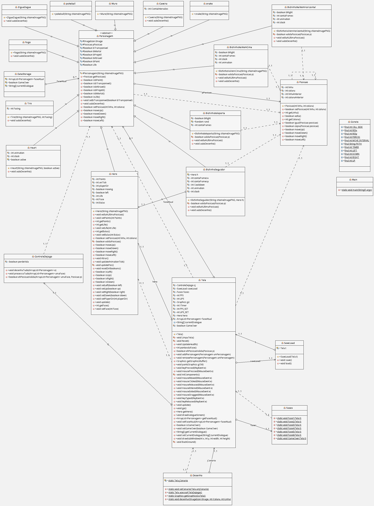

# Documentação do Trabalho de SCC0604 - Programação Orientada a Objetos

## Ministrada por José F. Rodrigues Jr

### Alunos:
- **Gabriela Passos de Andrade** - 12625142
- **Rafael Cunha Bejes Learth** - 13676367

---

## Objetivo do Documento
Este guia foi elaborado para fornecer esclarecimentos necessários à execução e compilação do trabalho de projeto do curso de Engenharia de Computação, trabalho de **SCC0604 - Programação Orientada a Objetos (POO)**. Aqui, você encontrará instruções passo a passo, recursos úteis e dicas para garantir o sucesso da execução do projeto.

---

## Alterações no Código Original
As seguintes alterações foram feitas no protótipo fornecido:

- Remoção das funções do mouse que alteravam a posição do personagem e exibiam as coordenadas do clique na tela, pois eram descritas apenas como auxiliares para a implementação do projeto.
- Substituição da opção de `clear` do jogo pela função `Reset()`, contribuindo para as funcionalidades de um jogo semelhante ao **EggLand** proposto.

---

## Descrição do Jogo
O jogo foi criado com base nas aventuras de **EggLand**, com várias funcionalidades semelhantes, mas com uma ideia mais original. A proposta é representar "a volta para casa" passando pelas **quatro estações do ano**:

1. Verão
2. Outono
3. Inverno
4. Primavera

Após as quatro fases principais, foram adicionadas:
- Uma **fase extra**;
- Uma **fase de agradecimentos e créditos** para finalização do jogo.

---

## Instruções de Execução
Siga as instruções abaixo para executar o projeto:

1. Abra o arquivo **Protótipo POO** no **NetBeans**, preferencialmente na versão 17.
2. Configure as variáveis de ambiente, se necessário.
3. Compile o código clicando no botão **Clean and Build Project** no NetBeans ou utilizando o atalho de teclado `Shift + F11`.
4. Execute o programa clicando em **Run Project** ou utilizando o atalho `F6`.

---

## Solução de Problemas Comuns
- **Problema**: Após apertar "Run", a tela do jogo aparece em branco.
  - **Soluções**:
    1. Saia e tente rodar o jogo novamente.
    2. Altere a seguinte linha no método `main`: 
       ```java
       tTela.createBufferStrategy(3);
       ```
       Para:
       ```java
       tTela.createBufferStrategy(2);
       ```
    3. Caso o problema persista, tente trocar de sistema operacional ou computador.

---

## Recursos Úteis
- **Avançar de fase automaticamente**: pressione a tecla `F` duas vezes (para facilitar a avaliação e testes). 
  - **Nota**: este recurso seria removido para um jogo fora do contexto acadêmico.
- **Resetar a fase**: utilize a tecla `R`.
- **Salvar o progresso**: pressione a tecla `K` (ela salva o progresso na fase).
- **Carregar o progresso**: pressione a tecla `L`.
- **Atirar**: colete um ponto para habilitar balas no jogo.

---

## Diagrama UML
<div align="center">
  
</div>

---

## Contatos de Suporte
Se encontrar dificuldades ou tiver dúvidas, entre em contato com os criadores:

- **Gabriela Passos de Andrade**: [gabipandrade@usp.br](mailto:gabipandrade@usp.br)
- **Rafael Cunha Bejes Learth**: [rafael.learth@usp.br](mailto:rafael.learth@usp.br)
